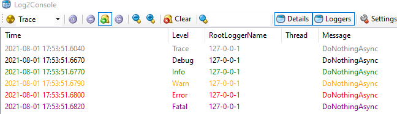

[](https://github.com/aimenux/SerilogSinksDemo/actions/workflows/ci.yml)

# SerilogSinksDemo
```
Using Serilog to send logs to various sinks
```

> In this repo, i m using serilog in order to enable logging to various sinks in console applications :
>
> - 2 configuration ways : code config based or json config based (chosen randomly at startup)
>
> - 4 sinks : console, file, udp, appinsights
>
> 
>

**`Tools`** : net 8.0, serilog